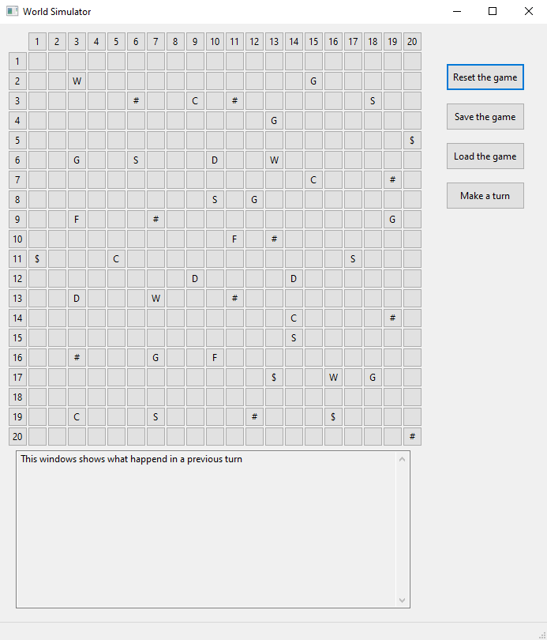

# VirtualWorld APP (university task)

Simple virtual world simulator based on the turn-based system where a user can perform turns and watch how the environment is changing. There are two types of organisms:
plants and animals. Each kind of animal has it's own additional behaviour, each kind of plant provides another effect after being eaten. User can perform a turn,
reset the simulation, save and load the world.

<h1 align="center">
  </a>
</h1>

Every turn each animal moves on the adjacent field. If there is an animal of the same kind - they reproduce and a new animal appears on the map. If there is an animal of 
different type - they fight. Stronger animal survives, weaker dies. If animal steps on the plant, it eats it and gains an some additional effect. Plants cannot move, but 
they have 8% to reproduce itself during a turn.

# List of the organisms
## Animals
* Dog (D) - the range of movement is 2 fields.
* Fox (F) - it never moves into the field with a stronger animal.
* Sheep (S) - none.
* Sloth ($) - it move every second turn.
* Wolf (W) - none.

## Plants
* Grass (#) - none.
* Coca (C) - animal that has eaten Coca moves twice during next turn.
* Guaranna (G) - animal that has eaten Guaranna has increased strength by 3.

## Technologies
Project is created with:
* wxWidgets library version: 3.2.1
